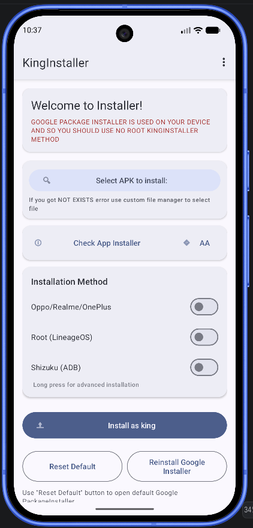
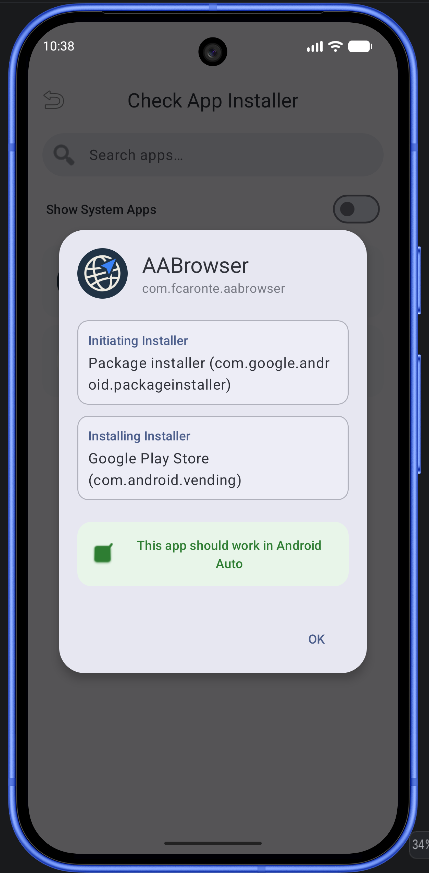
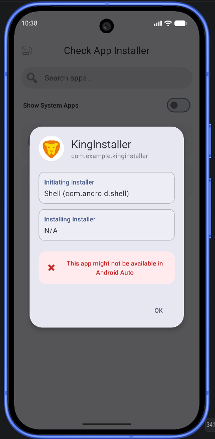
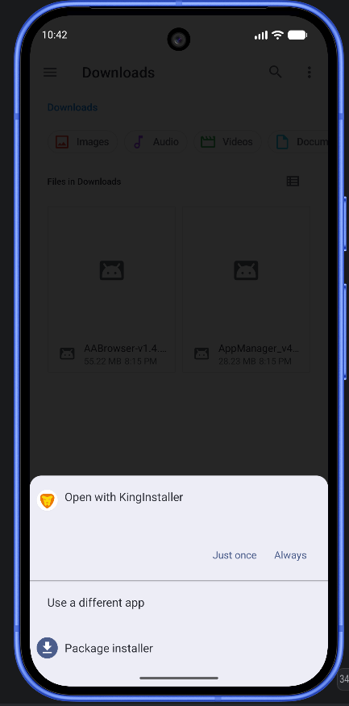

---

# KingInstaller

Install packages "as Google Play Store" to work around restrictions! Useful for Android Auto.

---

## 🚀 What is KingInstaller?

KingInstaller is a utility designed to install APK files in a way that tricks the system (and Android Auto) into thinking the application originated directly from the official Google Play Store, helping bypass specific app visibility restrictions.

---

## 📸 Screenshots

  
  
  
  

---

## ✨ Features & Recent Updates (v1.7)

* **Hybrid Installation (Shizuku/Root):** New advanced method for Android 15/17 that ensures "Requested by: Package Installer" and "Installed by: Play Store".
* **Auto-Fixer:** Automatically repairs the installer identity immediately after installation if Shizuku or Root is available.
* **Material Design 3 UI:** Modernized interface embracing clean layouts and Material 3 guidelines.
* **Support the Project:** Added a quick link to support development via PayPal.
* **App Diagnostic Checker:** Built-in tool to inspect how the system perceives an installed application.
* **Android Auto Settings Shortcut:** Quick shortcut button to jump straight into AA settings.

---

## ⚠️ Compatibility & Android Auto Requirements

### 📊 System Compatibility

* **Android 10 - 17:** Now fully supported! Use the standard "Install as King" method for Android 10-16. 
* **Android 17+:** Standard method is blocked by Google. **USE THE SHIZUKU TRICK.**
* **Samsung (One UI 6.0 to 8.5+):** Standard method works perfectly. **Avoid Shizuku on Samsung** unless necessary, as Samsung's "Auto Blocker" security feature often blocks ADB-based installations.
* **Oppo/Realme/OnePlus:** Use the specific tricks provided in the app switches.

### 💉 Shizuku Method (Recommended for Android 15/17)
If the standard installation doesn't work or doesn't show "Installed by: Play Store", use [Shizuku](https://github.com/rikkaapps/shizuku).
1. Download and start the **Shizuku** app (via Wireless Debugging or ADB).
2. Enable the **Shizuku Trick** in KingInstaller.
3. KingInstaller will now use a "Hybrid Proxy" to launch the system installer with elevated privileges, bypassing modern security blocks.

---

## 🚗 Android Auto Rules & Insights

Based on extensive testing:
* **The Golden Rule:** For an app to work in Android Auto, the **"Requested by"** field should ideally be the Package Installer, while the **"Installed by"** field **MUST be the Play Store**.
* **The ADB Trap:** Standard ADB installs (`com.android.shell`) are often ignored by Android Auto. v1.7 solves this via the Hybrid Shizuku method.

---

## 🛠️ Usage

1. Download and install the latest KingInstaller release.
2. Select your `.apk` file.
3. If you are on Android 15+, it is highly recommended to use **Shizuku**.
4. Click **Install**.
5. After installation, use the "Check App Installer" button to verify the result.

---

## ☕ Support my work
If KingInstaller helped you, consider supporting the project:
[**Donate via PayPal**](https://www.paypal.com/paypalme/FCaronte/2)

---

## 📝 Notes & Limitations

* Make sure to enable **Unknown Sources** in Android Auto's Developer Settings.
* Some apps carry hardcoded restrictions. Consider using Xposed modules if KingInstaller alone isn't enough.
